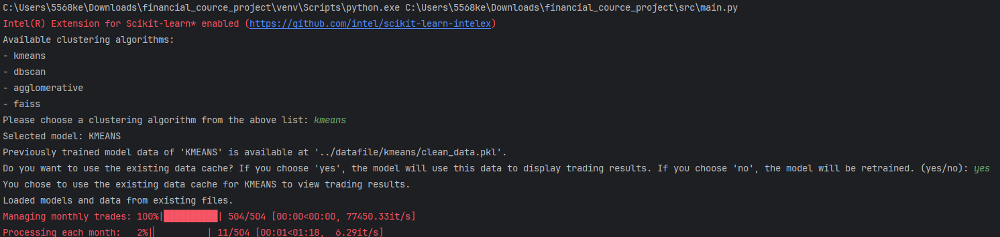

# Financial course final Project

## Overview
This project aims to analyze financial data using clustering algorithms to identify investment opportunities and manage and execute trades through a pair trading strategy, inspired by the paper "Pairs Trading via Unsupervised Learning". Integrating data processing, cluster analysis, and trading strategies, the project aims to extract valuable information from complex market data and base their trading strategies on this information.

## Project structure & description
Below is the directory structure of the project and explanations for each module:

```
pair_trading_project/
├── datafile/                          # Directory for storing data files
│   └── ...                            # Data files location
├── plots/                             # Directory for storing generated plots
│   └── ...                            # Plot files showing investment returns and comparisons
├── print_project_structure.py         # Python script to print project structure
├── README.md                          # Project documentation file
├── requirements.txt                   # File listing required Python packages
├── src/                               # Directory for storing source code
│   ├── __init__.py                    # Initialization file for src directory
│   ├── clustering/                    # Directory for clustering algorithm related code
│   │   ├── __init__.py                # Initialization file for clustering directory
│   │   ├── agglomerative.py           # Implementation file for agglomerative clustering algorithm
│   │   ├── cluster_base.py            # Implementation file for clustering base class
│   │   ├── cluster_factory.py         # Implementation file for clustering factory
│   │   ├── dbscan.py                  # Implementation file for DBSCAN clustering algorithm
│   │   └── kmeans.py                  # Implementation file for K-Means clustering algorithm
│   ├── config.py                      # Project configuration file
│   ├── data_processing/               # Directory for data processing related code
│   │   ├── __init__.py                # Initialization file for data_processing directory
│   │   └── DataProcessor.py           # Implementation file for data processor
│   ├── main.py                        # Main program entry point and workflow control
│   ├── trading_strategy/              # Directory for trading strategy related code
│   │   ├── __init__.py                # Initialization file for trading_strategy directory
│   │   └── trading.py                 # Implementation file for trading strategy
│   └── utilities/                     # Directory for utilities related code
│       ├── __init__.py                # Initialization file for utilities directory
│       └── utils.py                   # Implementation file for utilities
└── venv/                              # Directory for Python virtual environment

```
## Module Descriptions
- **Data Processing (`data_processing`)**: Handles loading and preprocessing of financial datasets, converting them into formats suitable for analysis. Key tasks include cleaning data, handling missing values, and performing PCA for dimensionality reduction.
- **Clustering (`clustering`)**: Provides various clustering algorithms to group similar data points together, enhancing the identification of patterns within the data. This module supports K-means, DBSCAN, and potentially other clustering methods as configured.
- **Trading Strategy (`trading_strategy`)**: Utilizes the outputs from the clustering module to form trading strategies. The `PairTradingService` class implements the logic for identifying pairs and managing trades based on momentum indicators.

## Getting Started
### Install Dependencies

Before running the project, you must install the necessary Python packages that the project depends on. These dependencies are listed in the `requirements.txt` file. Depending on your package manager, you can install these using pip or a Conda-based environment manager like Anaconda or Miniconda. Here are the instructions for both methods:

- **Using pip**:
    Open your terminal or command prompt and execute the following command to install the packages with pip:

    ```bash
    pip install -r requirements.txt
    ```

    This will download and install all the required packages with the correct versions to ensure compatibility with the project.

- **Using Conda/Anaconda**:
    If you are using Conda or Anaconda, you can create a new environment and install the necessary packages using the `conda` command. Replace `myenv` with your preferred environment name:

    ```bash
    conda create --name myenv --file requirements.txt
    ```

    Activate the newly created environment with:

    ```bash
    conda activate myenv
    ```

Choose the installation method that best fits your workflow. Both will set up the environment necessary to run the project successfully.

### Before running the analysis

- Configuration File: Adjust the config.py file to set up your data sources and model parameters. The program will prompt you to select a model and whether to use cached data upon execution. The cached data will be stored in the path specified for the corresponding model in config.py.
- Here is an example of what the config.py script looks like:
```python
# File path configurations
PATHS = {
    'kmeans': {
        'models': "../datafile/kmeans/models_df.pkl",
        'data': "../datafile/kmeans/clean_data.pkl"
    },
    'dbscan': {
        'models': "../datafile/dbscan/models_df.pkl",
        'data': "../datafile/dbscan/clean_data.pkl"
    },
#    // ... other path configurations
}

# Algorithm parameters configuration
KMEANS_PARAMS = {
    'n_clusters': 32,
    'random_state': 1211
}
# // ... other algorithm parameters

```
Adjust the values to fit your specific data path and desired clustering behavior. 
### **Run the Program**: 
Execute main.py from the src/ directory to start the analysis:
```
cd src
python main.py
```
During program execution, messages will be displayed, the program will prompt you to select a model and whether to use cached data upon execution. The cached data will be stored in the path specified for the corresponding model in config.py. This interactive process is crucial for determining the workflow of the program.


Here is an example of what the program interaction looks like:



## Result

### Plot 
Below is a sample plot generated by the program, illustrating the investment return multipliers over time:

This plot provides a visual representation of the investment return multipliers, allowing users to analyze the performance of trading strategies and make informed decisions based on historical data.


### Data Files
The datafile/ directory contains cached data used during the analysis process. These files are organized based on the clustering algorithm used and store various stages of the analysis. Users can configure the paths to these directories in the config.py file.

```python
├── datafile/
│   ├── agglomerative/
│   │   ├── clean_data.pkl
│   │   ├── models_df.pkl
│   │   └── total_returns.pkl
│   ├── datashare/
│   │   ├── datashare.csv
│   │   ├── datashare.parquet
│   │   ├── datashare_features.parquet
│   │   └── datashare_pca.parquet
│   ├── dbscan/
│   │   ├── clean_data.pkl
│   │   ├── models_df.pkl
│   │   └── total_returns.pkl
│   └── kmeans/
│       ├── clean_data.pkl
│       ├── models_df.pkl
│       └── total_returns.pkl

```

#### File Descriptions:
- **clean_data.pkl**: Contains preprocessed and clustered data ready for use in trading.
- **models_df.pkl**: Stores the trained models and relevant details such as cluster centroids, labels, etc.
- **total_returns.pkl**: Holds the calculated list of total returns for each year from the trading strategy.

These files are generated and updated throughout the analysis process and are used to speed up subsequent runs by reusing previously computed results. Users have the option to configure these paths in the `config.py` file based on their preferences.

## References

### Academic Papers
- Chulwoo Han, Zhaodong He, and Alenson Jun Wei Toh, "Pairs Trading via Unsupervised Learning." Durham University and Nanyang Technological University, April 28, 2021.
- Simão Nava de Moraes Sarmento, "Enhancing a Pairs Trading strategy with the application of Machine Learning." Master of Science Thesis, Electrical and Computer Engineering, Universidade de Lisboa, September 2019.
- Weiguang Han, Boyi Zhang, Qianqian Xie, Min Peng, Yanzhao Lai, Jimin Huang. "Select and Trade: Towards Unified Pair Trading with Hierarchical Reinforcement Learning," in Proceedings of the KDD '23, August 6–10, 2023, Long Beach, CA, USA.
- Jeff Johnson, Matthijs Douze, and Hervé Jégou, "Billion-scale similarity search with GPUs," *arXiv preprint arXiv:1702.08734*, February 2017.

### Online Articles
- "Unsupervised Learning as Signals for Pairs Trading and StatArb," *Medium*, Call for Atlas. [Read here](https://medium.com/call-for-atlas/unsupervised-learning-as-signals-for-pairs-trading-and-statarb-c5d6bf3db7cb).
- "Pairs-Trading Strategy Analysis," *Medium*, Call for Atlas. [Read here](https://medium.com/call-for-atlas/pairs-trading-strategy-every-stock-needs-a-friend-e50723a1dc94).
